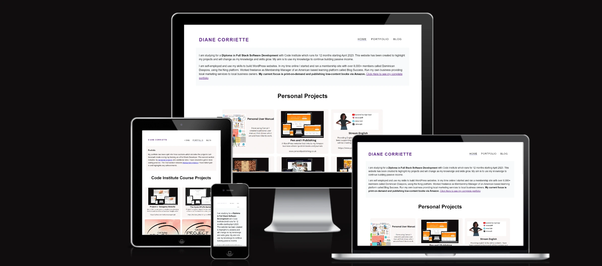

# ToDiane.dev

This is a two-page website created to document my journey towards becoming a **Full Stack Developer** with Code Institute. I registered in the last week of April 2023 and began looking at the course material from the first week in May.

The deployed website is here <https://todiane.github.io/toDianeDev/>

I have experience with WordPress so I am a little familiar with html and CSS but have never used or tried to learn javascript, python and other languages. While I am not new to css I haven't really had to use it very much because WordPress templates come ready made and I have only had to make minor changes to a template. 

This is the third website I have built from scratch using html and css. The first one being the love running run through project that is part of my course and the second is my first portfolio project The Sologamy Club - live link <https://todiane.github.io/sologamyp1/>

I started building this site on Friday 7th July until Sunday 9th July 2023. 

As my skills in javascript and/or python improve I will make changes to the website. 

## Issues.

The navigation on the smallest screen does not fit onto one line. Also the logo and navigation font are really small. I have tried to rectify this issue as of today 9th July 2023 and will look at it again soon but for now have decided not to spend any more hours on it.

## Testing

I ran the html code through W3C Validator and made corrections based on their suggestions. I originally had the website inside a frame and I removed that because frames are no longer used.

The css code was run through W3C CSS Validator and no errors were found.

## External blog.

I will be updating the website along with the WordPress blog I set up using the domain todiane.dev - <https://todiane.dev/>

## Credit

The images in the portfolio open up to display a larger version - the code for that was found on Stack Overflow
https://stackoverflow.com/questions/25036597/how-to-enlarge-an-image-on-hover-or-click

The navigation and footer were taken from my Sologamy website/Love Running project which are both part of my Full Stack Developer training with Code Institute.

The portfolio grid was created thanks to the flexbox css training I went through on Free Code Camp.org

Credit to me for learning about grids and flexboxes then using them to create this website!

